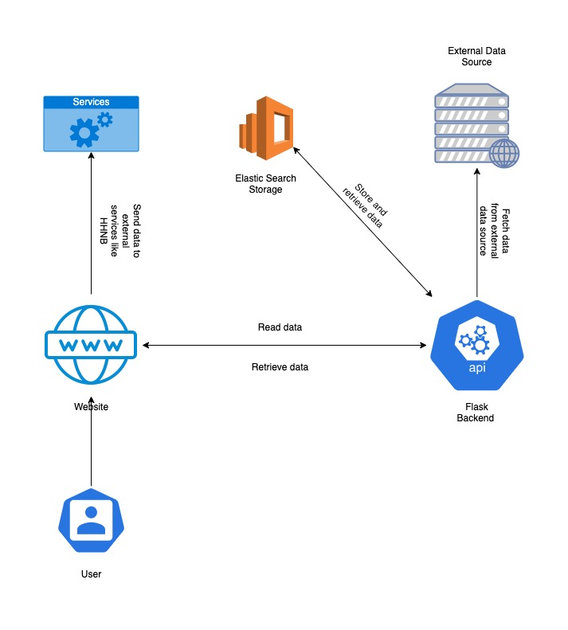

#HBP BACKEND

#INTRO

"HBP BACKEND" is a project developed using Flask for accomplish the goal to retrieve hippocampus data like morphologies, electrophysiologies
and models and serve it by rest api. For this purpose the "HBP BACKEND" store the data retrieved from various sources like neuromorpho.org, hippocampome and ModelDB in an uniforme format.

##SETUP
The project setup is very simple. All the project is Docker based and Docker is the only tool that you must manually install.

After install docker you can run :
`docker-compose up --build` for run the project.

##ARCHITECTURE
The architecture reflect the follow diagram.
The Flask Backend fetch external data source and store data (transformed to use a uniform format) in elastic search.
When the frontend request data, the backend retrieve previously stored in Elastic Search Storage and retrieve its.

##COMPONENTS

###BACKEND
The backend is built on Flask, a web development framework written in Python.
It was built with dependency injection in mind and for this reason make a large use of Flask-Injector. 
It defines a series of rest api that allow the frontend to retrieve data in an uniforme format.
On the startup the backend perform a fetch job for retrieve data from the external sources and store it on the storage system.

###STORAGE
The storage system is implemented using Elastic Search.
The choice of Elastic Search as the storage system was made with search features in mind.
The rest api, thankful to Elastic Search, make possibile to give full-text search in data with incredible performance.
The storage system provides 2 main index: dataset, model.

####DATASET INDEX
The dataset index contains all the data such as: morphology, electrophysiology and connections.
The data in this index is retrieved from multiple providers such as Neuromorpho, Hippocampome etc.
After some manipulation, the data were stored in an uniform format.

####MODEL INDEX
The model index contains all the model data.
At this moment this data are only retrieved from the ModelDB provider.

##PROJECT STRUCTURE
The project and folder structure follow this scheme:
1. Config: folder that contains configuration files: (one for each external provider)
2. Helpers: folder that contains helper classes and methods. It defines logic for interact with external provider, using the storage system, parse search arguments or download a file
3. Services: folder that contains injectable services that implements business logic.
4. Routes: folder that contains all rest api route definition files.

##PROVIDERS
The external providers from which the backend retrieve data was:
1. Neuromorpho
2. Hippocampome
3. ModelDB
4. Internal

###NEUROMORPHO
The most important key in Neuromorpho provider is the brain_regions.

This array define for which regions make the search.
The other keys define how to filter for data for the given regions.

At this moment is not possibile to add other filter.
The Neuromorpho provider only return morphologies with .asc and swc file.

##HIPPOCAMPOME
The Hippocampome provider have 3 values for filter:
1. Morphologies
2. Layers
3. Markers

You can experiment with this values for found the correct combination.

##MODEL DB
For the ModelDB provider there is only one configuration key "region_key".

It define the region for which run the search.

##API
Follow a list of available api divided by topics:

1. SEARCH APIS
2. DOWNLOAD APIS
3. FILTER APIS

Swagger documentation for all apis is available on http:://{host}/openapi.